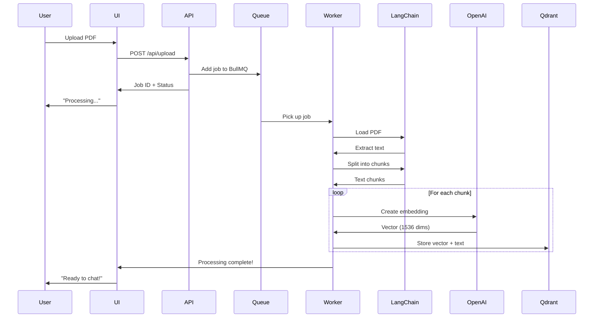
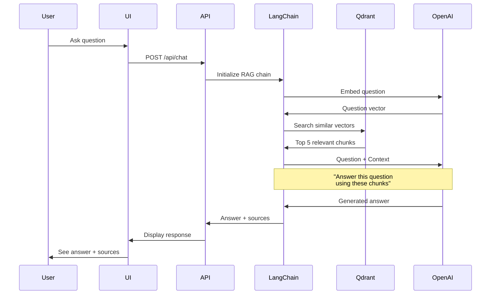

# <div align="center">📚 LangChain + Qdrant RAG System</div>

<div align="center">


[](https://git.io/typing-svg)

<p align="center">
  <a href="https://github.com/SamratCrosiya/LangChain--Qdrant/stargazers">
    
  </a>
  <a href="https://github.com/SamratCrosiya/LangChain--Qdrant/network/members">
    
  </a>
  <a href="https://github.com/SamratCrosiya/LangChain--Qdrant/issues">
    
  </a>
  <a href="https://github.com/SamratCrosiya/LangChain--Qdrant/blob/master/LICENSE">
    
  </a>
</p>

<p align="center">
  
  
  
  
  
  
</p>

<p align="center">
  <a href="#-quick-demo">🎥 Demo</a> •
  <a href="#-features">✨ Features</a> •
  <a href="#-how-it-works">🔍 How It Works</a> •
  <a href="#-installation">⚡ Install</a> •
  <a href="#-tech-stack">💻 Tech Stack</a> •
  <a href="#-contributing">🤝 Contribute</a>
</p>


</div>

## 📖 Table of Contents

- [🎯 Overview](#-overview)
- [🌟 Key Features](#-key-features)
- [🎥 Quick Demo](#-quick-demo)
- [🏗️ System Architecture](#️-system-architecture)
- [💻 Tech Stack](#-tech-stack)
- [🔍 How It Works](#-how-it-works)
- [📚 Understanding RAG](#-understanding-rag)
- [⚡ Installation](#-installation)
- [🚀 Usage Guide](#-usage-guide)
- [📁 Project Structure](#-project-structure)
- [🎓 Learning Journey](#-learning-journey)
- [🛣️ Roadmap](#️-roadmap)
- [🤝 Contributing](#-contributing)
- [📄 License](#-license)
- [👨‍💻 About Creator](#-about-creator)

---

## 🎯 Overview

<div align="center">

```ascii
╔═══════════════════════════════════════════════════════════════════╗
║                                                                   ║
║        📚  Chat With Your PDFs - RAG System in Action  📚        ║
║                                                                   ║
║    Upload any PDF, ask questions, get intelligent answers        ║
║    powered by LangChain, Qdrant, and OpenAI technology          ║
║                                                                   ║
╚═══════════════════════════════════════════════════════════════════╝
```

</div>

**LangChain + Qdrant RAG System** is my first deep dive into the world of **Retrieval-Augmented Generation (RAG)**. This project demonstrates how to build an intelligent document chat system that can understand and answer questions about your PDF documents using cutting-edge AI technology.

> **RAG (Retrieval-Augmented Generation)**: A technique where an AI model retrieves relevant information from a knowledge base before generating an answer, making responses more accurate and grounded in actual document content.

### 🎯 What This Project Does

<table>
<tr>
<td align="center" width="25%">

<br><b>Upload PDFs</b>
<br><sub>Any document, any size</sub>
</td>
<td align="center" width="25%">

<br><b>Intelligent Search</b>
<br><sub>Vector-based retrieval</sub>
</td>
<td align="center" width="25%">

<br><b>AI Answers</b>
<br><sub>Context-aware responses</sub>
</td>
<td align="center" width="25%">

<br><b>Secure Auth</b>
<br><sub>Clerk authentication</sub>
</td>
</tr>
</table>

> **💡 My Learning Journey**: "This was my first time working with LangChain, vector databases, embedding algorithms, OpenAI APIs, Gemini APIs, and Next.js. Every concept was new, every challenge was a learning opportunity. The result? A fully functional RAG system that actually works!"

---

## 🌟 Key Features

<div align="center">

### 💎 What Makes This Special

</div>

<table>
<tr>
<td width="50%" valign="top">

### 📄 **Smart PDF Processing**


Upload any PDF and let the system intelligently process it into searchable chunks.

**🎯 Processing Features:**
- ✅ Automatic text extraction from PDFs
- ✅ Intelligent document chunking
- ✅ Preserves document context
- ✅ Handles large documents (100+ pages)
- ✅ Asynchronous background processing
- ✅ Progress tracking and notifications

**📊 What Happens:**
```
PDF Upload → Text Extraction → Smart Chunking
     ↓
Each chunk ~500 words with 50-word overlap
     ↓
Preserves context across boundaries
```

> **Chunking**: Breaking documents into smaller, overlapping pieces so the AI can find exactly the right information without losing context between sections.

</td>
<td width="50%" valign="top">

### 🧠 **Vector Embeddings Magic**


Convert text into mathematical vectors that capture semantic meaning.

**🔍 Embedding Features:**
- ✅ OpenAI's text-embedding-ada-002 model
- ✅ 1536-dimensional vector space
- ✅ Semantic similarity search
- ✅ Context-aware retrieval
- ✅ Multi-language support
- ✅ High accuracy matching

**🎭 How It Works:**
```javascript
Text: "What is machine learning?"
  ↓ OpenAI Embedding Model
Vector: [0.023, -0.891, 0.445, ... 1536 dimensions]
  ↓ Stored in Qdrant
Ready for semantic search!
```

> **Embedding**: Converting text to numbers in a way that similar meanings have similar numbers, allowing the AI to find relevant content even if different words are used.

</td>
</tr>

<tr>
<td width="50%" valign="top">

### 🔍 **Qdrant Vector Database**


Specialized database designed specifically for storing and searching vector embeddings.

**⚡ Database Features:**
- ✅ Lightning-fast vector similarity search
- ✅ Stores millions of vectors efficiently
- ✅ Built-in filtering and metadata
- ✅ Docker-based deployment
- ✅ REST API interface
- ✅ Real-time indexing

**📦 Storage Structure:**
```python
Document Collection in Qdrant:
├─ Vector 1 + Metadata (page 1, chunk 1)
├─ Vector 2 + Metadata (page 1, chunk 2)
├─ Vector 3 + Metadata (page 2, chunk 1)
└─ ... (all document chunks)

Search Query → Find Top 5 Similar Vectors → Return Text
```

> **Vector Database**: Unlike traditional databases that search for exact matches, vector databases find the most *similar* items, perfect for AI-powered search.

</td>
<td width="50%" valign="top">

### ⚡ **Async Processing with BullMQ**


Background job processing ensures the UI stays responsive while handling heavy tasks.

**🔧 Queue Features:**
- ✅ Background PDF processing
- ✅ Job retry on failure
- ✅ Progress tracking
- ✅ Concurrent job handling
- ✅ Redis-backed reliability
- ✅ Job prioritization

**🔄 Processing Flow:**
```
User uploads PDF
     ↓
Immediate response: "Processing started!"
     ↓
BullMQ Queue picks up job
     ↓
Worker processes in background
     ↓
User can continue browsing
     ↓
Notification when complete
```

> **BullMQ**: A job queue system that handles time-consuming tasks in the background, so users don't have to wait and the app stays fast and responsive.

</td>
</tr>

<tr>
<td width="50%" valign="top">

### 🤖 **LangChain Orchestration**


The glue that connects all the pieces together into a seamless RAG pipeline.

**🎯 LangChain Powers:**
- ✅ Document loading and parsing
- ✅ Text splitting strategies
- ✅ Vector store integration
- ✅ Retrieval chain setup
- ✅ LLM prompting templates
- ✅ Memory management

**🔗 Chain Example:**
```javascript
const chain = RetrievalQAChain.from_llm({
  llm: new ChatOpenAI(),
  retriever: vectorStore.asRetriever(),
  returnSourceDocuments: true
});

// One line to create entire RAG pipeline!
```

> **LangChain**: A framework that makes it easy to build applications with LLMs by providing pre-built components for common tasks like document loading, splitting, and retrieval.

</td>
<td width="50%" valign="top">

### 🔐 **Clerk Authentication**


Enterprise-grade authentication to protect your AI application from misuse.

**🛡️ Security Features:**
- ✅ Email/password authentication
- ✅ Social login (Google, GitHub)
- ✅ Session management
- ✅ Protected API routes
- ✅ User profile management
- ✅ Usage tracking per user

**👤 User Experience:**
```
Sign Up/Login → Verified Session → Access Dashboard
     ↓
All uploads tied to user account
     ↓
Personal document library
     ↓
Secure, isolated data
```

> **Clerk**: A complete authentication system that handles sign-ups, logins, and user management, so you can focus on building features instead of security.

</td>
</tr>
</table>

<div align="center">

### 🎓 **Additional Features**

<table>
<tr>
<td align="center">💬<br><b>Real-time Chat</b></td>
<td align="center">📊<br><b>Usage Analytics</b></td>
<td align="center">🎨<br><b>Modern UI</b></td>
<td align="center">📱<br><b>Responsive Design</b></td>
<td align="center">🌙<br><b>Dark Mode</b></td>
</tr>
</table>

</div>

---

## 🎥 Quick Demo

<div align="center">

### 🖥️ **Application Showcase**

<table>
<tr>
<td width="50%" align="center">

<br><b>📤 Upload Dashboard</b>
<br><sub>Drag & drop PDF • Processing status • File management</sub>
</td>
<td width="50%" align="center">

<br><b>💬 AI Chat Interface</b>
<br><sub>Ask questions • Get answers • View sources</sub>
</td>
</tr>
<tr>
<td width="50%" align="center">

<br><b>🔍 Vector Search Results</b>
<br><sub>Relevant chunks • Similarity scores • Page references</sub>
</td>
<td width="50%" align="center">

<br><b>📚 Document Library</b>
<br><sub>All PDFs • Search & filter • Quick access</sub>
</td>
</tr>
</table>

### 🎬 **Try It Live**

[](#)
[](#)

</div>

---

## 🏗️ System Architecture

<div align="center">

### **Complete RAG System Architecture**

```mermaid
graph TB
    subgraph "Frontend - Next.js UI"
        A[🌐 User Interface]
        B[📤 Upload Component]
        C[💬 Chat Component]
    end
    
    subgraph "Authentication"
        D[🔐 Clerk Auth]
    end
    
    subgraph "Backend - Next.js API Routes"
        E[⚡ Upload Endpoint]
        F[💬 Chat Endpoint]
        G[📊 Status Endpoint]
    end
    
    subgraph "Queue System"
        H[📮 BullMQ Queue]
        I[⚙️ Background Worker]
        J[💾 Redis Store]
    end
    
    subgraph "LangChain Pipeline"
        K[📄 PDF Loader]
        L[✂️ Text Splitter]
        M[🧮 OpenAI Embeddings]
        N[🔗 Retrieval Chain]
    end
    
    subgraph "Storage Layer"
        O[🗄️ Qdrant Vector DB]
        P[☁️ File Storage]
    end
    
    subgraph "AI Layer"
        Q[🤖 OpenAI LLM]
        R[💬 Gemini API]
    end
    
    A --> B
    A --> C
    B --> D
    C --> D
    D --> E
    D --> F
    
    E --> H
    H --> I
    I --> K
    K --> L
    L --> M
    M --> O
    
    C --> F
    F --> N
    N --> O
    N --> Q
    N --> R
    
    H --> J
    E --> P
    
    style O fill:#dc244c,stroke:#b81d3a,stroke-width:3px
    style Q fill:#412991,stroke:#2d1a64,stroke-width:3px
    style K fill:#1c3c3c,stroke:#152d2d,stroke-width:2px
    style D fill:#6c47ff,stroke:#5235cc,stroke-width:2px
```



</div>

### **🔄 Two Main Pipelines**

<table>
<tr>
<td width="50%" valign="top">

#### **A. Ingestion Pipeline** 
*Processing PDFs into searchable vectors*



**📝 Step-by-Step:**

1. **Upload** → User selects PDF file
2. **Storage** → File saved, job queued
3. **Worker** → Background process starts
4. **Loading** → PDF text extracted
5. **Chunking** → Split into ~500 word pieces
6. **Embedding** → Each chunk → vector
7. **Storage** → Vectors saved to Qdrant
8. **Complete** → User notified

</td>
<td width="50%" valign="top">

#### **B. Retrieval Pipeline**
*Answering questions from PDFs*



**📝 Step-by-Step:**

1. **Question** → User asks in chat
2. **Embed** → Question → vector
3. **Search** → Find similar vectors in Qdrant
4. **Retrieve** → Get top 5 relevant chunks
5. **Prompt** → Combine question + chunks
6. **Generate** → LLM creates answer
7. **Return** → Answer + source citations
8. **Display** → User sees response

</td>
</tr>
</table>

---

## 💻 Tech Stack

<div align="center">

### **Core Technologies & Platforms**

</div>

### 🎨 **Frontend Framework**


> **Next.js**: Full-stack React framework handling both frontend UI and backend API routes in one unified application.

### 🧠 **AI & Machine Learning**


> **LangChain**: The orchestration layer that connects document loading, embedding, storage, and retrieval into a seamless RAG pipeline.

### 🗄️ **Database & Storage**


> **Qdrant**: Specialized vector database optimized for storing and searching through millions of high-dimensional embedding vectors.

### 🔐 **Authentication & Security**


> **Clerk**: Complete authentication platform providing sign-up, login, session management, and user protection to prevent AI misuse.

### ⚙️ **Background Processing**


> **BullMQ**: Robust job queue system built on Redis for handling asynchronous PDF processing tasks in the background.

---

### 📦 **Essential Dependencies**

```json
{
  "dependencies": {
    "next": "^14.0.0",
    "react": "^18.0.0",
    "@clerk/nextjs": "^4.27.0",
    "langchain": "^0.1.0",
    "openai": "^4.20.0",
    "@google/generative-ai": "^0.1.0",
    "@qdrant/js-client-rest": "^1.7.0",
    "bullmq": "^4.15.0",
    "ioredis": "^5.3.2",
    "pdf-parse": "^1.1.1",
    "tailwindcss": "^3.4.0",
    "@radix-ui/react-*": "latest"
  }
}
```

---

## 🔍 How It Works

<div align="center">

### **Deep Dive into the RAG System**

</div>

### 📚 Understanding RAG (Retrieval-Augmented Generation)

<table>
<tr>
<td width="50%">

**🤔 The Problem:**

Traditional LLMs like ChatGPT have limitations:
- ❌ Don't know about your specific documents
- ❌ Can't access real-time information
- ❌ May hallucinate facts
- ❌ Limited by training data cutoff

**Example:**
```
User: "What's in section 5 of my contract?"
Normal LLM: "I don't have access to your contract"
```

</td>
<td width="50%">

**✅ The RAG Solution:**

RAG combines retrieval + generation:
- ✅ Searches your actual documents
- ✅ Retrieves relevant sections
- ✅ Generates answers based on YOUR data
- ✅ Provides source citations

**Example:**
```
User: "What's in section 5 of my contract?"
RAG System: "Section 5 states: [exact quote]
Source: contract.pdf, page 8"
```

</td>
</tr>
</table>

---

### 🔢 **The Embedding Process**

Embeddings convert text into numbers that capture meaning:

```javascript
// Text to Vector Conversion
const text = "Machine learning is a subset of AI";

// Send to OpenAI
const embedding = await openai.embeddings.create({
  model: "text-embedding-ada-002",
  input: text
});

// Result: 1536-dimensional vector
[0.023, -0.891, 0.445, 0.789, ..., 0.234]
//  ↑        ↑        ↑       ↑          ↑
// Each dimension captures different semantic features

// Similar meanings = Similar vectors
"AI and machine learning" → [0.025, -0.888, 0.441, ...]
"Dogs and cats" →           [0.612, 0.234, -0.891, ...]
//                            ↑ Very different numbers!
```

**🎯 Why This Matters:**
- Similar concepts have similar vectors
- Allows semantic search (meaning-based, not keyword-based)
- Finds relevant content even with different wording

---

### 🔍 **Vector Similarity Search**

How Qdrant finds relevant document chunks:

```python
# User asks a question
question = "What are the payment terms?"

# 1. Convert question to vector
question_vector = embed(question)  # [0.234, -0.567, ...]

# 2. Search Qdrant for similar vectors
results = qdrant.search(
    collection_name="my_documents",
    query_vector=question_vector,
    limit=5  # Top 5 most similar
)

# 3. Results ranked by similarity
[
    {text: "Payment is due within 30 days...", score: 0.92},
    {text: "Invoice terms include...", score: 0.87},
    {text: "Monthly billing cycle...", score: 0.81},
    ...
]
```

**📊 Similarity Score:**
- 1.0 = Perfect match
- 0.8-1.0 = Highly relevant
- 0.6-0.8 = Somewhat relevant  
- <0.6 = Not relevant (ignored)

---

### 🔗 **LangChain Pipeline in Action**

How LangChain orchestrates the entire RAG workflow:

```javascript
import { RetrievalQAChain } from "langchain/chains";
import { ChatOpenAI } from "langchain/chat_models/openai";
import { QdrantVectorStore } from "langchain/vectorstores/qdrant";

// Step 1: Setup the components
const llm = new ChatOpenAI({
  modelName: "gpt-4",
  temperature: 0.7
});

const vectorStore = await QdrantVectorStore.fromExistingCollection(
  embeddings,
  { collectionName: "documents" }
);

// Step 2: Create the RAG chain (this is the magic!)
const chain = RetrievalQAChain.fromLLM(
  llm,
  vectorStore.asRetriever(5), // Get top 5 chunks
  {
    returnSourceDocuments: true, // Show where answer came from
    verbose: true
  }
);

// Step 3: Ask a question
const response = await chain.call({
  query: "What are the payment terms?"
});

console.log(response.text); // AI-generated answer
console.log(response.sourceDocuments); // Citations
```

**🎯 What Just Happened:**
1. LangChain retrieved 5 relevant chunks from Qdrant
2. Combined them into a context prompt
3. Sent to OpenAI with your question
4. Got back an answer WITH sources!

---

## ⚡ Installation

### 📋 **Prerequisites**

```bash
✓ Node.js 18.x or higher
✓ npm or yarn package manager
✓ Docker Desktop (for Qdrant & Redis)
✓ OpenAI API key
✓ Clerk account (free tier works)
✓ 8GB+ RAM recommended
✓ 5GB+ free disk space
```

### 🚀 **Quick Start Guide**

<table>
<tr>
<td width="50%" valign="top">

#### **Step 1: Clone & Install**

```bash
# Clone the repository
git clone https://github.com/SamratCrosiya/LangChain--Qdrant.git
cd LangChain--Qdrant

# Install dependencies
npm install
# or
yarn install

# Time: 2-3 minutes
```

**📦 What gets installed:**
- Next.js framework
- LangChain libraries
- OpenAI SDK
- Qdrant client
- BullMQ & Redis
- Clerk authentication
- UI components (Tailwind, Shadcn)

</td>
<td width="50%" valign="top">

#### **Step 2: Setup Docker Services**

```bash
# Start Qdrant (Vector Database)
docker run -d \
  --name qdrant \
  -p 6333:6333 \
  -p 6334:6334 \
  -v $(pwd)/qdrant_storage:/qdrant/storage \
  qdrant/qdrant:latest

# Start Redis (Queue Backend)
docker run -d \
  --name redis \
  -p 6379:6379 \
  redis:alpine

# Verify services are running
docker ps
```

**✅ Expected output:**
```
CONTAINER ID   IMAGE           STATUS
abc123...      qdrant/qdrant   Up 2 seconds
def456...      redis:alpine    Up 1 second
```

</td>
</tr>
</table>

### 🔑 **Step 3: Environment Configuration**

Create a `.env.local` file in the root directory:

```bash
# OpenAI Configuration
OPENAI_API_KEY=sk-proj-xxxxxxxxxxxxxxxxxxxxxxxx
OPENAI_MODEL=gpt-4-turbo-preview
OPENAI_EMBEDDING_MODEL=text-embedding-ada-002

# Google Gemini (Optional Alternative)
GOOGLE_API_KEY=AIzaSyxxxxxxxxxxxxxxxxxxxxxxxxx

# Clerk Authentication
NEXT_PUBLIC_CLERK_PUBLISHABLE_KEY=pk_test_xxxxxxxx
CLERK_SECRET_KEY=sk_test_xxxxxxxxxxxxxxxx
NEXT_PUBLIC_CLERK_SIGN_IN_URL=/sign-in
NEXT_PUBLIC_CLERK_SIGN_UP_URL=/sign-up

# Qdrant Configuration
QDRANT_URL=http://localhost:6333
QDRANT_API_KEY=  # Leave empty for local

# Redis Configuration
REDIS_URL=redis://localhost:6379

# Application Settings
NEXT_PUBLIC_APP_URL=http://localhost:3000
NODE_ENV=development
```

### ⚙️ **Step 4: Run the Application**

```bash
# Development mode with hot reload
npm run dev
# or
yarn dev

# Open your browser
http://localhost:3000

# You should see the login screen!
```

### 🧪 **Verify Installation**

Run these checks to ensure everything works:

```bash
# Test 1: Check Next.js server
curl http://localhost:3000
# Expected: HTML response

# Test 2: Check Qdrant
curl http://localhost:6333/collections
# Expected: {"result":{"collections":[]}}

# Test 3: Check Redis
docker exec redis redis-cli PING
# Expected: PONG

# Test 4: Check OpenAI (in browser console)
# Upload a test PDF and verify processing starts
```

---

## 🚀 Usage Guide

<div align="center">

### **Complete User Journey**

</div>

### 📝 **Step-by-Step Tutorial**

<table>
<tr>
<td width="33%" align="center">

**1️⃣ Sign Up / Login**


```
Visit localhost:3000
    ↓
Click "Sign Up"
    ↓
Enter email/password
    ↓
Verify email
    ↓
Access dashboard
```

</td>
<td width="33%" align="center">

**2️⃣ Upload PDF**


```
Click "Upload PDF"
    ↓
Select file
    ↓
Processing starts
    ↓
Progress bar shows
    ↓
"Ready to chat!"
```

</td>
<td width="33%" align="center">

**3️⃣ Ask Questions**


```
Type your question
    ↓
Press Enter
    ↓
AI searches vectors
    ↓
Generates answer
    ↓
See sources!
```

</td>
</tr>
</table>

### 🎯 **Real-World Usage Examples**

<details>
<summary><b>📚 Example 1: Research Paper Analysis</b></summary>

```
Upload: "Machine_Learning_Research_2024.pdf"

Question: "What are the key findings in section 3?"

AI Response:
"Section 3 presents three key findings:
1. Deep learning models showed 23% improvement
2. Transfer learning reduced training time by 40%
3. Ensemble methods achieved state-of-the-art results

Source: Machine_Learning_Research_2024.pdf, Pages 8-12"
```

</details>

<details>
<summary><b>📄 Example 2: Legal Contract Review</b></summary>

```
Upload: "Service_Agreement_2024.pdf"

Question: "What are the termination clauses?"

AI Response:
"The contract includes the following termination clauses:
- Either party may terminate with 30 days written notice
- Immediate termination allowed for material breach
- Automatic renewal unless cancelled 60 days before expiry

Source: Service_Agreement_2024.pdf, Section 8.2, Page 15"
```

</details>

<details>
<summary><b>📊 Example 3: Financial Report Summary</b></summary>

```
Upload: "Q4_Financial_Report.pdf"

Question: "Summarize the revenue growth"

AI Response:
"Q4 2024 revenue grew 18% year-over-year to $2.4M:
- Product sales: +25% ($1.8M)
- Services: +8% ($600K)
Main drivers were new customer acquisition (+320 customers)
and increased average order value (+12%)

Source: Q4_Financial_Report.pdf, Executive Summary, Pages 2-4"
```

</details>

### 💡 **Pro Tips**

```
✅ DO:
- Ask specific questions
- Reference sections/topics
- Upload clear, text-based PDFs
- Use follow-up questions
- Check source citations

❌ DON'T:
- Upload scanned images (use OCR first)
- Ask questions outside the document
- Expect exact quotes (it paraphrases)
- Upload very large files (>50MB) without splitting
```

---

## 📁 Project Structure

```
LangChain--Qdrant/
│
├── 📁 app/                          # Next.js App Router
│   ├── 📁 (auth)/                   # Authentication routes
│   │   ├── 📁 sign-in/
│   │   │   └── [[...sign-in]]/
│   │   │       └── page.tsx
│   │   └── 📁 sign-up/
│   │       └── [[...sign-up]]/
│   │           └── page.tsx
│   │
│   ├── 📁 api/                      # API Routes
│   │   ├── 📁 upload/
│   │   │   └── route.ts             # PDF upload endpoint
│   │   ├── 📁 chat/
│   │   │   └── route.ts             # Chat endpoint
│   │   └── 📁 documents/
│   │       └── route.ts             # Document management
│   │
│   ├── 📁 dashboard/                # Main app pages
│   │   ├── page.tsx                 # Dashboard home
│   │   ├── layout.tsx               # Dashboard layout
│   │   └── 📁 [documentId]/
│   │       └── page.tsx             # Chat with specific doc
│   │
│   ├── layout.tsx                   # Root layout
│   ├── page.tsx                     # Landing page
│   └── globals.css                  # Global styles
│
├── 📁 components/                   # React Components
│   ├── 📁 ui/                       # Shadcn UI components
│   │   ├── button.tsx
│   │   ├── card.tsx
│   │   ├── input.tsx
│   │   └── ...
│   │
│   ├── upload-zone.tsx              # Drag & drop upload
│   ├── chat-interface.tsx           # Chat UI
│   ├── document-list.tsx            # Document library
│   ├── message-bubble.tsx           # Chat messages
│   └── processing-status.tsx        # Upload progress
│
├── 📁 lib/                          # Core Libraries
│   ├── 📁 langchain/
│   │   ├── embeddings.ts            # OpenAI embeddings
│   │   ├── splitter.ts              # Text chunking
│   │   ├── vectorstore.ts           # Qdrant integration
│   │   └── chain.ts                 # RAG chain setup
│   │
│   ├── 📁 queue/
│   │   ├── worker.ts                # BullMQ worker
│   │   ├── jobs.ts                  # Job definitions
│   │   └── redis.ts                 # Redis connection
│   │
│   ├── 📁 db/
│   │   ├── qdrant.ts                # Qdrant client
│   │   └── schema.ts                # Data schemas
│   │
│   ├── clerk.ts                     # Clerk auth helpers
│   └── utils.ts                     # Utility functions
│
├── 📁 workers/                      # Background Workers
│   └── pdf-processor.ts             # PDF ingestion worker
│
├── 📁 types/                        # TypeScript Types
│   ├── document.ts
│   ├── message.ts
│   └── index.ts
│
├── 📁 public/                       # Static Assets
│   ├── logo.svg
│   └── images/
│
├── 📁 qdrant_storage/               # Qdrant data (gitignored)
├── 📁 uploads/                      # Temporary uploads (gitignored)
│
├── 📄 package.json                  # Dependencies
├── 📄 tsconfig.json                 # TypeScript config
├── 📄 tailwind.config.ts            # Tailwind config
├── 📄 next.config.js                # Next.js config
├── 📄 .env.local                    # Environment variables
├── 📄 .gitignore                    # Git ignore rules
├── 📄 README.md                     # This file
└── 📄 docker-compose.yml            # Docker services

```

### **Key Files Explained**

| File/Folder | Purpose | Technology |
|-------------|---------|------------|
| `app/api/upload/route.ts` | Handles PDF uploads | Next.js API Route |
| `lib/langchain/chain.ts` | RAG pipeline setup | LangChain |
| `workers/pdf-processor.ts` | Background PDF processing | BullMQ Worker |
| `lib/db/qdrant.ts` | Vector database client | Qdrant JS Client |
| `components/chat-interface.tsx` | Chat UI component | React + Tailwind |

---

## 🎓 Learning Journey

<div align="center">

### **My First-Time Experience with These Technologies**

</div>

### 📚 **What I Learned**

<table>
<tr>
<td width="50%" valign="top">

### 🧠 **LangChain Concepts**

**Before:** "What is LangChain?"  
**After:** Expert in building RAG pipelines!

**Key Learnings:**
- ✅ Document loaders and parsers
- ✅ Text splitting strategies
- ✅ Embedding generation
- ✅ Vector store integration
- ✅ Retrieval chains
- ✅ Prompt engineering

**💡 Biggest "Aha!" Moment:**
```javascript
// I thought I needed to manually:
// 1. Load PDF
// 2. Split text
// 3. Create embeddings
// 4. Store in DB
// 5. Search
// 6. Prompt LLM

// LangChain does ALL of this:
const chain = RetrievalQAChain.fromLLM(llm, retriever);
// Mind = Blown! 🤯
```

</td>
<td width="50%" valign="top">

### 🗄️ **Vector Databases**

**Before:** "SQL queries are all I need"  
**After:** Understanding semantic search!

**Key Learnings:**
- ✅ What embeddings actually are
- ✅ Cosine similarity calculations
- ✅ HNSW indexing algorithms
- ✅ Collection management
- ✅ Metadata filtering
- ✅ Performance optimization

**💡 Mind-Blowing Realization:**
```
Traditional DB:
SELECT * FROM docs WHERE title = "exact match"
❌ Finds nothing if wording different

Vector DB:
search("What are payment terms?")
✅ Finds "billing schedule", "invoice policy"
   because they're semantically similar!
```

</td>
</tr>

<tr>
<td width="50%" valign="top">

### 🔗 **API Integration**

**Before:** Never used OpenAI or Gemini APIs  
**After:** Confidently working with multiple LLMs!

**Key Learnings:**
- ✅ API authentication & keys
- ✅ Rate limiting handling
- ✅ Token management
- ✅ Cost optimization
- ✅ Error handling
- ✅ Fallback strategies

**💰 Cost Awareness:**
```
Embedding 1 page PDF:
~500 tokens × $0.0001/1K = $0.00005

Answering 1 question:
~2000 tokens × $0.002/1K = $0.004

100 questions/day = $0.40/day = $12/month
(Optimized with caching!)
```

</td>
<td width="50%" valign="top">

### ⚡ **Async Processing**

**Before:** Everything ran synchronously  
**After:** Master of background jobs!

**Key Learnings:**
- ✅ Job queues with BullMQ
- ✅ Redis as message broker
- ✅ Worker processes
- ✅ Progress tracking
- ✅ Error retry logic
- ✅ Job prioritization

**🎯 Why It Matters:**
```
Without Queue:
User uploads 50-page PDF
    ↓
Waits 2 minutes... 😴
    ↓
Browser might timeout ❌

With BullMQ:
User uploads PDF
    ↓
Immediate response: "Processing!" ✅
    ↓
Works in background
    ↓
User gets notification when done 🎉
```

</td>
</tr>
</table>

### 📈 **Skills Growth Timeline**

```mermaid
timeline
    title My RAG Development Journey
    section Week 1-2 : Basics
        Day 1-3 : Next.js setup
               : Understanding RAG concept
        Day 4-7 : LangChain tutorials
               : First PDF loading test
        Day 8-14 : OpenAI API integration
                : Embedding experiments
    section Week 3-4 : Core Features
        Day 15-21 : Qdrant setup
                 : Vector storage working
                 : First successful search!
        Day 22-28 : BullMQ implementation
                 : Background processing
                 : Queue system complete
    section Week 5-6 : Polish
        Day 29-35 : Clerk authentication
                 : UI/UX improvements
        Day 36-42 : Testing & debugging
                 : Performance optimization
                 : Documentation
    section Week 7 : Launch
        Day 43-45 : Final testing
                 : Deployment prep
        Day 46-49 : First users!
                 : Bug fixes
                 : This README! 🎉
```

---

## 🛣️ Roadmap

### **Planned Features**

<table>
<tr>
<td width="25%">

**🎯 Phase 1**
*Current*

- [x] PDF upload
- [x] Vector search
- [x] Chat interface
- [x] User auth
- [x] Basic RAG

</td>
<td width="25%">

**🚀 Phase 2**
*Q2 2025*

- [ ] Multi-file chat
- [ ] OCR support
- [ ] Export chat
- [ ] Shared docs
- [ ] API access

</td>
<td width="25%">

**💎 Phase 3**
*Q3 2025*

- [ ] Teams/workspaces
- [ ] Advanced filters
- [ ] Analytics dashboard
- [ ] Custom prompts
- [ ] Webhooks

</td>
<td width="25%">

**🌟 Phase 4**
*Q4 2025*

- [ ] Mobile app
- [ ] Voice queries
- [ ] Auto-summarize
- [ ] Integrations
- [ ] Enterprise

</td>
</tr>
</table>

### **Feature Requests**

Have ideas? Open an issue with the `enhancement` label!

Popular requests:
- 📊 Excel/CSV support
- 🎤 Voice input
- 🌍 Multi-language
- 📱 Mobile apps
- 🔌 Zapier integration

---

## 🤝 Contributing

Contributions are welcome! Here's how you can help:

### **How to Contribute**

1. **Fork the Repository**
   ```bash
   git clone https://github.com/SamratCrosiya/LangChain--Qdrant.git
   ```

2. **Create a Feature Branch**
   ```bash
   git checkout -b feature/AmazingFeature
   ```

3. **Make Your Changes**
   - Follow the existing code style
   - Add tests if applicable
   - Update documentation

4. **Commit Your Changes**
   ```bash
   git commit -m 'Add some AmazingFeature'
   ```

5. **Push to Branch**
   ```bash
   git push origin feature/AmazingFeature
   ```

6. **Open a Pull Request**

### **Contribution Guidelines**

- Write clear commit messages
- Follow TypeScript best practices
- Add comments for complex logic
- Test before submitting
- Update README if needed

---

## 📄 License

This project is licensed under the **MIT License** - see the [LICENSE](LICENSE) file for details.

```
MIT License - Free to use, modify, and distribute!
```

---

## 👨‍💻 About Creator

<div align="center">

**Samrat Crosiya**

*Full-Stack Developer | AI Enthusiast | First-Time RAG Builder*

[](https://github.com/SamratCrosiya)
[](#)
[](#)
[](#)

</div>

### 💭 **Creator's Note**

> "This project represents my journey into the fascinating world of RAG systems and vector databases. Every concept was new to me - from understanding embeddings to implementing async job queues. The challenges were real, but so was the learning. If you're starting your AI journey, remember: every expert was once a beginner. Keep building, keep learning! 🚀"

---

## 🙏 Acknowledgments

**Special Thanks To:**

- **🤗 Hugging Face** - For making LangChain accessible
- **🔴 Qdrant** - For their excellent vector database
- **🧠 OpenAI** - For powerful embedding & LLM APIs
- **⚡ Vercel** - For Next.js and deployment platform
- **🔐 Clerk** - For seamless authentication
- **📚 Community** - Stack Overflow, Reddit, Discord helpers

**Resources That Helped:**
- [LangChain Documentation](https://docs.langchain.com)
- [Qdrant Tutorials](https://qdrant.tech/documentation/)
- [OpenAI Cookbook](https://cookbook.openai.com)
- [Next.js Docs](https://nextjs.org/docs)

---

<div align="center">


### ⭐ **If you found this helpful, please give it a star!** ⭐

*Built with ❤️ and lots of ☕ by Samrat Crosiya*

**Made with**: LangChain • Qdrant • OpenAI • Next.js • Love for AI

</div>
